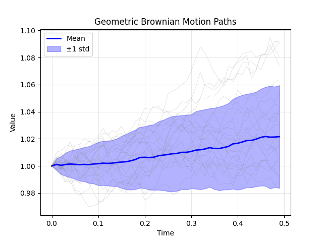
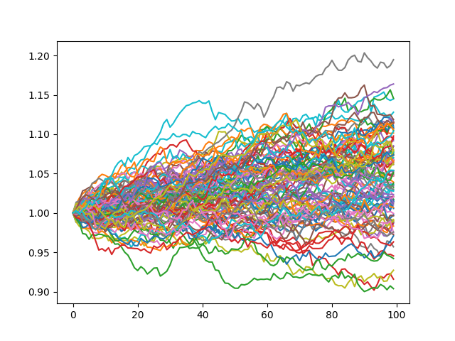

# SDE Simulator

High-performance 1D stochastic differential equation (SDE) simulator with CPU SIMD optimization and GPU acceleration.



## Features

- **Multiple Backends**: CPU (SIMD-optimized), Metal (Apple Silicon), CUDA (NVIDIA GPUs)
- **Custom Expression Language**: Define drift and diffusion using mathematical expressions
- **Numerical Methods**: Euler-Maruyama and Milstein schemes with automatic differentiation
- **Python Integration**: Zero-copy NumPy arrays for seamless data science workflows
- **CLI Tool**: Full-featured command-line interface with SQLite expression caching
- **High Performance**: Optimized for Monte Carlo simulations

## Quick Start (Python)
```python
import sde_simulator as sde
import numpy as np
import matplotlib.pyplot as plt

# Create simulator for Geometric Brownian Motion
sim = sde.SDESimulator(
    drift="mu * x",
    diffusion="sigma * x"
)

# Simulate 100 paths
results = sim.simulate(
    num_paths=100,
    num_steps=100,
    dt=0.01,
    backend="cpu",
    params={"mu": 0.05, "sigma": 0.3}
)

# Plot
plt.plot(results)
plt.show()
```


The Python module will be in `build/src/python/`.

### CLI Tool

After building, the CLI is available at `build/src/cli/SDE-CLI`:
```bash
# Store an expression(to be clear gbm is automatically added)
./SDE-CLI store gbm --drift "mu * x" --diffusion "sigma * x"

# Run simulation
./SDE-CLI run gbm --paths 10000 --steps 1000 --dt 0.01 \
    mu=0.05 sigma=0.3 --rand-sample 10 -o results.csv
```


## Supported Models

Built-in cached models:
- **gbm**: Geometric Brownian Motion
- **ou**: Ornstein-Uhlenbeck
- **cir**: Cox-Ingersoll-Ross
- **vasicek**: Vasicek interest rate model
- **cev**: Constant Elasticity of Variance

Or define your own using mathematical expressions!

## Installation

```bash
git clone https://github.com/yourusername/SDE-Simulator.git
cd SDE-Simulator
mkdir build && cd build
cmake ..
make
```
This will make  both the CLI and Python Bindings.

### Cmake options

| Option | Description | Default |
|--------|-------------|---------|
| `BUILD_PYTHON_BINDINGS` | Build Python bindings | ON |
| `BUILD_CLI` | Build command-line interface | ON |
| `BUILD_TESTS` | Build test suite | OFF |
| `Python_EXECUTABLE` | Specify Python version | Auto-detect |


## Requirements

- C++20 compiler
- CMake 3.20+
- Python 3.8+ (for bindings)
- Metal (macOS) or CUDA (Linux/Windows) for GPU support

## License

MIT License - see LICENSE file

## Citation

If you use this in research, please cite:
```bibtex
@software{SDE-Simulator,
  author = {Parker White},
  title = {SDE Simulator: High-Performance Stochastic Differential Equation Solver},
  year = {2025},
  url = {https://github.com/parkeeeer/SDE-Simulator}
}
```

## Architecture

- **Frontend**: Custom lexer → parser → AST → bytecode/CUDA/Metal compiler
- **Optimization**: SIMD vectorization (ARM NEON, x86 AVX), Multi-threading, minimax polynomial approximations, GPU acceleration 
- **GPU**: Runtime kernel compilation for Metal/CUDA
- **Python**: pybind11 with zero-copy NumPy integration